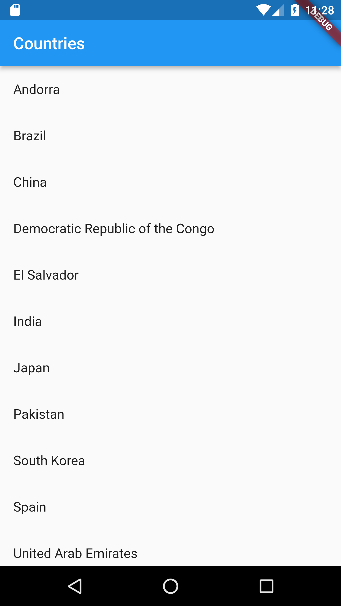
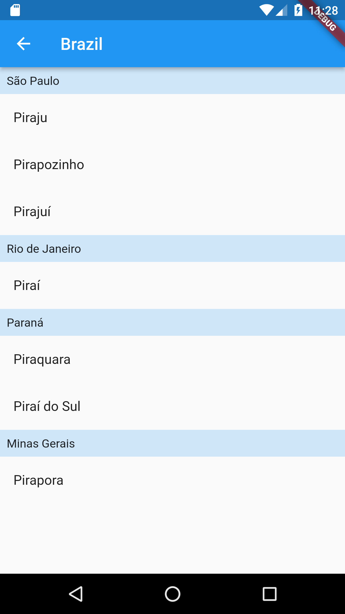

# fullstack_dev_test_app

App that list countries and cities

## Prerequisites

- Flutter (and all dependencies to run it)
- Firebase CLI

## Setup

The first step is configure with your firebase using [this guide](https://firebase.google.com/docs/flutter/setup?platform=ios#prerequisites), then it will generate a *firebase_options.dart* file with all configs.
After that, you can run the commands below:

```bash
flutter pub get
flutter run
```

## Screenshots

<p align="center">
  
  
</p>